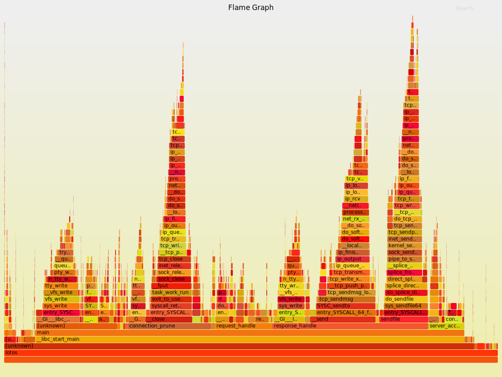
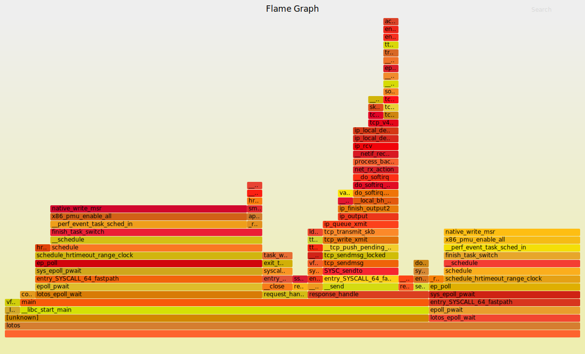
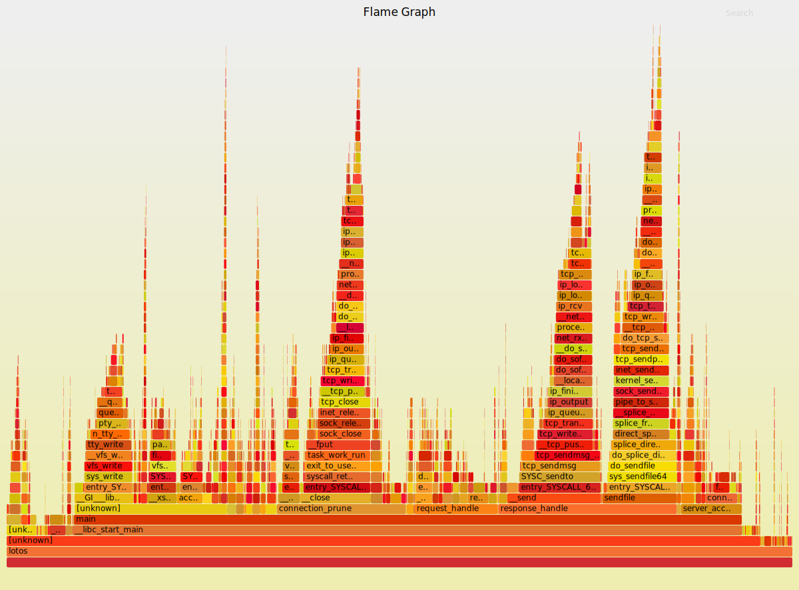
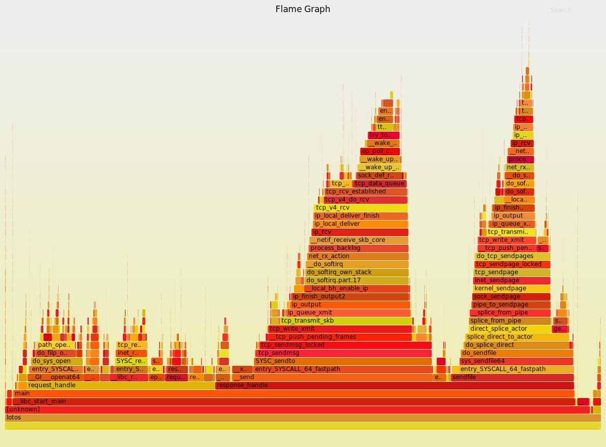

# 问题1

## 问题描述

使用`wrk`进行压力测试，发现`Avg Req/Sec`只有10^2数量级，显然不符合预期。请求返回的`Avg Latency` 也在40ms左右，在单机测试的环境下，这也是很长的响应时间了。

下面是wrk的测试报告：
```
$ wrk -t5 -c10 -d10s http://localhost:8888/ -vvv
wrk  [epoll] Copyright (C) 2012 Will Glozer
wrk  [epoll] Copyright (C) 2012 Will Glozer
wrk  [epoll] Copyright (C) 2012 Will Glozer
Running 10s test @ http://localhost:8888/
  5 threads and 10 connections
  Thread Stats   Avg      Stdev     Max   +/- Stdev
    Latency    43.72ms    3.16ms  49.97ms   99.21%
    Req/Sec    45.68      6.97    60.00     88.00%
  2284 requests in 10.01s, 333.74KB read
Requests/sec:    228.12
Transfer/sec:     33.33KB

```

## Debug记录

一开始猜测是在某个函数上开销比较大，但是函数太多，具体到某个函数又不容易定位。于是想起可以用`on-cpu 火焰图`分析函数执行耗时。

针对是否使用http keep-alive选项，对`lotos`使用两种模式的压力测试。

- `ab`版本

  ab版本不加keep-alive，纯http1.0模式，得到

- `wrk`版本

  采用http/1.1协议，支持keep-alive，得到

ab版本的火焰图很符合预期，每次都会建立、断开tcp连接，请求、回复的handler占有的比重也很正常，总之是个很漂亮的火焰图😉。

相比ab版本，发现wrk版本在epoll_wait上等待较多，cpu的采样点也少得可怜，可以大胆猜测应该是在某处IO上阻塞了。

我给`lotos`的主事件循环中加入了一些调试信息，采用`curl`命令发起keep-alive请求，命令如下
```
curl localhost:8000 localhost:8000 -vvv
```
命令的返回如下：
```
$ curl localhost:8888 -o /dev/null localhost:8888 -o /dev/null  -vvv
* Rebuilt URL to: localhost:8888/
  % Total    % Received % Xferd  Average Speed   Time    Time     Time  Current
                                 Dload  Upload   Total   Spent    Left  Speed
  0     0    0     0    0     0      0      0 --:--:-- --:--:-- --:--:--     0*   Trying ::1...
* TCP_NODELAY set
* connect to ::1 port 8888 failed: 連線被拒絕
*   Trying 127.0.0.1...
* TCP_NODELAY set
* Connected to localhost (127.0.0.1) port 8888 (#0)
> GET / HTTP/1.1
> Host: localhost:8888
> User-Agent: curl/7.57.0
> Accept: */*
>
< HTTP/1.1 200 OK
< Date: Tue, 30 Jan 2018 07:08:59 GMT
< Server: lotos/0.1
< Content-Type: text/html
< Content-Length: 6
< Connection: keep-alive
<
{ [6 bytes data]
100     6  100     6    0     0      6      0  0:00:01 --:--:--  0:00:01   666
* Connection #0 to host localhost left intact
* Rebuilt URL to: localhost:8888/
* Found bundle for host localhost: 0x55fc045f4460 [can pipeline]
* Re-using existing connection! (#0) with host localhost
* Connected to localhost (127.0.0.1) port 8888 (#0)
> GET / HTTP/1.1
> Host: localhost:8888
> User-Agent: curl/7.57.0
> Accept: */*
>
< HTTP/1.1 200 OK
< Date: Tue, 30 Jan 2018 07:08:59 GMT
< Server: lotos/0.1
< Content-Type: text/html
< Content-Length: 6
< Connection: keep-alive
<
{ [6 bytes data]
100     6  100     6    0     0      6      0  0:00:01 --:--:--  0:00:01     6
* Connection #0 to host localhost left intact

```

输出中的`Re-using existing connection! (#0) with host localhost`确实表明了curl确实重用了这条tcp连接。

对应的`lotos`的调试信息：
```
epoll: 0
epoll: 0
epoll: 1
[2018-01-30 10:12:25] fd:  6 127.0.0.1:43556

[2018-01-30 10:12:25] malloc 0x56418c766c70 1

[2018-01-30 10:12:25] ---------------accept

epoll: 1
0x56418c766c70 in 6
[2018-01-30 10:12:25] 0---------------in 108 us

[2018-01-30 10:12:25] 0---------------out 0 us

epoll: 1
[2018-01-30 10:12:25] 0---------------in 0 us

0x56418c766c70 out 6
send 143 bytes
send 0 bytes
[2018-01-30 10:12:25] 0---------------out 130 us

epoll: 1
0x56418c766c70 in 6
[2018-01-30 10:12:25] 0---------------in 51 us

[2018-01-30 10:12:25] 0---------------out 0 us

epoll: 1
[2018-01-30 10:12:25] 0---------------in 0 us

0x56418c766c70 out 6
send 143 bytes
send 0 bytes
[2018-01-30 10:12:25] 0---------------out 87 us

epoll: 0
epoll: 0
epoll: 1
0x56418c766c70 in 6
[2018-01-30 10:12:25] -1---------------in 27 us

[2018-01-30 10:12:25] -1---------------out 0 us

[2018-01-30 10:12:25] prune 0x56418c766c70 1

epoll: 0
epoll: 0
epoll: 0
epoll: 0
```

问题出现了，
```
0x56418c766c70 out 6
send 143 bytes
send 0 bytes
[2018-01-30 10:12:25] 0---------------out 87 us

epoll: 0
epoll: 0
epoll: 1
0x56418c766c70 in 6
[2018-01-30 10:12:25] -1---------------in 27 us
```

在最后一次给客户端发送完之后，`epoll_wait`出现了两次等待超时！！！很神奇！！！压力测试的工具竟然会延迟给我返回数据？ 或者，是我的程序发送数据存在延迟??? 可是我已经设置了禁用Nagle算法!!!(大四的网络程序设计课吃过瘪，很有印象)。

掏出神器strace执行`strace -tt ./lotos -r /tmp -t 10 -w 4 -d`，发现确实存在两次`epoll_wait`的超时，正好是40ms的阻塞。
```
00:39:34.964433 sendfile(7, 8, NULL, 6) = 6
00:39:34.964535 sendfile(7, 8, NULL, 6) = 0
00:39:34.964616 close(8)                = 0
00:39:34.964692 epoll_ctl(5, EPOLL_CTL_MOD, 7, {EPOLLET, {u32=717054400, u64=94206529724864}}) = 0
00:39:34.964776 epoll_ctl(5, EPOLL_CTL_MOD, 7, {EPOLLIN|EPOLLET, {u32=717054400, u64=94206529724864}}) = 0
00:39:34.964858 epoll_pwait(5, [], 10240, 20, NULL, 8) = 0
00:39:34.985093 epoll_pwait(5, [], 10240, 20, NULL, 8) = 0
00:39:35.005413 epoll_pwait(5, [{EPOLLIN, {u32=717054400, u64=94206529724864}}], 10240, 20, NULL, 8) = 1
00:39:35.006764 recvfrom(7, "GET / HTTP/1.1\r\nHost: 192.168.1."..., 8192, 0, NULL, NULL) = 44
00:39:35.006875 recvfrom(7, 0x7ffe23f19810, 8192, 0, NULL, NULL) = -1 EAGAIN (Resource temporarily unavailable)
00:39:35.006929 openat(3, "./", O_RDONLY) = 6
00:39:35.007000 fstat(6, {st_mode=S_IFDIR|S_ISVTX|0777, st_size=840, ...}) = 0
00:39:35.007104 openat(6, "index.html", O_RDONLY) = 8

```
掏出wireshark抓包看也是一切正常。囧了。google搜索也没给出答案（关键词不对:sweat:

后来我发现不论`epoll_wait`的超时值设为多少，`Avg Latency` 总是在40ms左右。于是把`40ms`作为关键词google之，发现还真是Nagle算法的问题。估计是我代码写错了吧，去排查一下，发现果真对文件描述符0做了设置TCP_NODELAY的操作！！！我真的是写bug的程序员...

修改了代码之后，问题瞬间就不存在了。
重新生成火焰图，

- `ab`版本

  ab版本不加keep-alive，纯http1.0模式，得到

- `wrk`版本

  采用http/1.1协议，支持keep-alive，得到

  关于Nagle算法，我觉得这篇文章已经讲得很清晰[《神秘的40毫秒延迟与 TCP_NODELAY》](http://jerrypeng.me/2013/08/mythical-40ms-delay-and-tcp-nodelay/)。

  lotos的设计上确实也是http headers和body分开发送，所以headers被立即发送("send data immediately")，body则被放在缓冲区里面("enqueue data in the buffer until an acknowledge is received")，直到对面40ms的超时ACK来临，才会把body发送出去。

  好吧，虽然我知道很多服务器都设置TCP_NODELAY，包括nginx，以前也只是经验性的设置一下该选项，直到今天踩了坑，才对这玩意有更深的理解。调试过程也是一个学习成长的过程！


# 问题2

## 问题描述

使用wrk压力测试时候，程序莫名退出，也没有打印出任何错误信息。

## Debug记录

掏出gdb，在gdb中运行，然后使用wrk压力测试。

```
Program received signal SIGPIPE, Broken pipe.
0x00007ffff7b1751d in send () from /usr/lib/libc.so.6
```

恍然大悟，原来是没有处理SIGPIPE。[`man 7 pipe`](https://linux.die.net/man/7/pipe)中写的很清楚。

> If all file descriptors referring to the write end of a pipe have been closed, then an attempt to read(2) from the pipe will see end-of-file (read(2) will return 0). If all file descriptors referring to the read end of a pipe have been closed, then a write(2) will cause a SIGPIPE signal to be generated for the calling process. If the calling process is ignoring this signal, then write(2) fails with the error EPIPE. An application that uses pipe(2) and fork(2) should use suitable close(2) calls to close unnecessary duplicate file descriptors; this ensures that end-of-file and SIGPIPE/EPIPE are delivered when appropriate.

当对端关闭了连接，并且本端忽略了SIGPIPE信号，那么`write`系统调用会失败并且设置errno为EPIPE。
