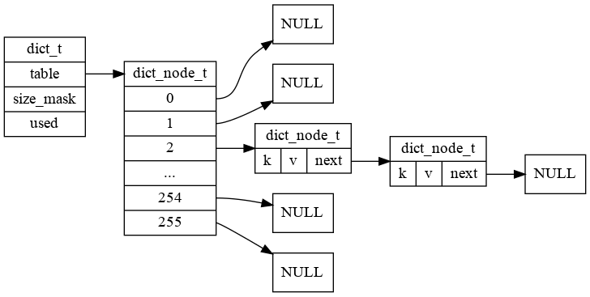

# 设计与实现

## 0x01 重要的结构体

1.配置信息结构(server.h)

```c
typedef struct {
  uint16_t port;   /* listen port */
  bool debug;      /* debug mode */
  int timeout;     /* connection expired time */
  uint32_t worker; /* worker num */
  char *rootdir;   /* html root directory */
  int rootdir_fd;  /* fildes of rootdir */
} config_t;
```

2.请求/响应缓冲结构(buffer.h)

```c
typedef struct {
  int len;    /* used space length in buf */
  int free;   /* free space length in buf */
  char buf[]; /* store data */
} buffer_t;
```

采用柔性数组，可以动态增长，围绕该结构设计了一系列操作函数。

3.简单静态字符串结构(ssstr.h)

```c
typedef struct {
  char *str;
  int len;
} ssstr_t;
```

对于字符串字面常量以及`buffer_t`结构的子串，都可以用该结构描述而无需开启新的缓冲区存储。有效节省了空间。

4.HTTP连接结构(connection.h)

```c
struct connection {
  int fd;                   /* connection fildes */
  struct epoll_event event; /* epoll event */
  struct sockaddr_in saddr; /* IP socket address */
  time_t active_time;       /* connection accpet time */
  int heap_idx;             /* idx at lotos_connections */
  request_t req;            /* request */
};
typedef struct connection connection_t;
```

5.请求信息结构(request.h)

```c
struct request {
  struct connection *c;                 /* belonged connection */
  buffer_t *ib;                         /* request buffer */
  buffer_t *ob;                         /* response buffer */
  parse_archive par;                    /* parse_archive */
  int resource_fd;                      /* resource fildes */
  int resource_size;                    /* resource size */
  int status_code;                      /* response status code */
  int (*req_handler)(struct request *); /* request handler for rl, hd, bd */
  int (*res_handler)(struct request *); /* response handler for hd bd */
};
typedef struct request request_t;
```

6.HTTP请求解析结构(http_parser.h)

```c
typedef struct {
  /* parsed request line result */
  http_method method;
  http_version version;
  ssstr_t request_url_string;
  req_url url;

  /* parsed header lines result */
  bool keep_alive;       /* connection keep alive */
  int content_length;    /* request body content_length */
  int transfer_encoding; /* affect body recv strategy */
  request_headers_t req_headers;

  int num_headers;
  ssstr_t header[2]; /* store header every time `parse_header_line` */

  /* preserve buffer_t state, so when recv new data, we can keep parsing */
  char *next_parse_pos; /* parser position in buffer_t */
  int state;            /* parser state */

  /* private members, do not modify !!! */
  char *method_begin;
  char *url_begin;
  char *header_line_begin;
  char *header_colon_pos;
  char *header_val_begin;
  char *header_val_end;
  size_t body_received;
  int buffer_sent;
  bool isCRLF_LINE;
  bool response_done;
  bool err_req;
} parse_archive;
```

7.错误页面结构(response.h)

```c
typedef struct {
  int err_page_fd;             /* fildes of err page */
  const char *raw_err_page;    /* raw data of err page file */
  size_t raw_page_size;        /* size of err page file */
  buffer_t *rendered_err_page; /* buffer contains err msg */
  size_t rendered_page_size;   /* size of err page file */
} err_page_t;
```

## 0x02 数据结构

### 1.最小堆(connection.c)

connection.c实现了一个最小二叉堆， 依据每个connection的active_time比较大小。因为二叉堆是一个完全二叉树的形态，为了简化编程，可以使用数组来存储堆结点。假设堆顶的position为0，按照层次遍历（BFS）的顺序编号，那么position为`i`的结点，左孩子的position为`2*i+1`, 右孩子的position为`2*i+2`。有了这层关系，可以通过position很快定位到孩子或者父结点的位置。

在这样的基础上，实现了以下操作：

- heap_bubble_up
- heap_bubble_down
- heap_insert

### 2.HashMap(dict.c)

实现了一个简单的HashMap。将其结构画出来，应该也是很一目了然的。



有一个小细节需要注意，通常我们需要把hash函数算出来的hash值映射回一个HashMap数组的对应位置，使其可以被加入索引。虽然最简单直接的想法是通过取模运算(%)，但是%运算比较低效，在大规模的查询/插入操作时很费CPU时间。换一个方式，我们可以规定的HashMap数组的长度为2的幂(如16,32,64...)，这样数组的范围就是[0, 2^n-1]，映射回HashMap数组的对应方法可以是 `index = Hash(key) & (Length - 1)`。这样`Length - 1`的二进制低位就全是1，如此可以均匀地把key映射到数组中。Lotos的实现中，HashMap的数组长度定为256，可以通过修改`DICT_MASK_SIZE`宏来改变数组长度。

在Lotos中，HashMap的使用场景数据量比较小，就没有考虑负载因子、rehash等因素，仅仅实现了最简单的功能。

- dict_init
- dict_put
- dict_get
- dict_free

## 0x03 NIO配合epoll

所有关于epoll的问题几乎都可以在[`man 7 epoll`](https://linux.die.net/man/7/epoll)中找到。manual写的很详细了，也给了服务器处理事件循环的样例代码，大部分采用epoll的服务器结构无外乎如此。

```c

/* Set up listening socket, 'listen_sock' (socket(),
   bind(), listen()) */

epollfd = epoll_create(10);
if (epollfd == -1) {
    perror("epoll_create");
    exit(EXIT_FAILURE);
}

ev.events = EPOLLIN;
ev.data.fd = listen_sock;
if (epoll_ctl(epollfd, EPOLL_CTL_ADD, listen_sock, &ev) == -1) {
    perror("epoll_ctl: listen_sock");
    exit(EXIT_FAILURE);
}

for (;;) {
    nfds = epoll_wait(epollfd, events, MAX_EVENTS, -1);
    if (nfds == -1) {
        perror("epoll_pwait");
        exit(EXIT_FAILURE);
    }

   for (n = 0; n < nfds; ++n) {
        if (events[n].data.fd == listen_sock) {
            conn_sock = accept(listen_sock,
                            (struct sockaddr *) &local, &addrlen);
            if (conn_sock == -1) {
                perror("accept");
                exit(EXIT_FAILURE);
            }
            setnonblocking(conn_sock);
            ev.events = EPOLLIN | EPOLLET;
            ev.data.fd = conn_sock;
            if (epoll_ctl(epollfd, EPOLL_CTL_ADD, conn_sock,
                        &ev) == -1) {
                perror("epoll_ctl: conn_sock");
                exit(EXIT_FAILURE);
            }
        } else {
            do_use_fd(events[n].data.fd);
        }
    }
}
```

epoll中很重要的一个结构体类型是`struct epoll_event`， 它包含了一个`epoll_data_t`类型的联合对象`data`。

```c
typedef union epoll_data {
  void *ptr;
  int fd;
  uint32_t u32;
  uint64_t u64;
} epoll_data_t;

struct epoll_event {
  uint32_t events;   /* Epoll events */
  epoll_data_t data; /* User data variable */
};
```

样例代码中`ev.data.fd = conn_sock;`，直接使用`fd`成员存储新建立连接的文件描述符，这样做简洁明了，但是需要额外的代码去描述一个连接的状态。在Lotos中使用了`connection_t`类型来描述一个连接的属性和状态，所以Lotos使用了`ptr`成员来保存`connection_t`实例的地址。

## 0x04 长连接与超时关闭

相比于HTTP/1.0，在服务器端发送完数据后关闭文件描述符即可，HTTP/1.1支持长连接，这就需要考虑连接的超时关闭问题，否则大量的非活动连接会消耗尽系统资源。

Lotos将所有连接注册进一个最小堆，active_time表示该连接上次活动的Epoch时间，active_time越小，表明该连接上次活动时间越早，越有可能超时。当连接建立或者有IO操作时，active_time会被更新，并且在堆中的位置会做相应调整。在每次的事件循环中，都会检查一下堆顶的连接是否超时(connection_prune函数)，若超时则关闭连接、移出最小堆。对连接的操作中假若出现了错误，需要关闭连接，最简单的办法是将其active_time设为很小的一个值(比如0)，然后等待connection_prune函数将其移除。

## 0x05 HTTP请求解析

对于HTTP请求体的解析，可以采用有穷状态机(FSM)逐个字母匹配，也可以采用简单的字符串匹配方式。 由于Lotos采用了NIO，不一定可以一次得到完整的请求体(这点在[测试调试](./DEBUG.md)部分也有体现)，所以保存连接请求的解析状态是必不可少的工作，否则每次请求体到来之后从头解析就显得愚钝了。状态机恰好可以可以满足这种需求，写起来也不是特别复杂，[RFC2016](https://www.w3.org/Protocols/rfc2616/rfc2616.html)已经给出了BNF范式，照着BNF范式逐字匹配即可，遇到对不上的请求体返回错误即可。Lotos目前实现了Request Line、Header和部分Body的解析，解析代码都在[http_parser.c](../src/http_parser.c)中，解析的结果保存在`parse_archive`类型的结构体中，`request_t`类型有一个`parse_archive`类型的成员`par`，用来记录每个请求解析的状态以及结果。

## 0x06 状态管理

NIO决定了每一个IO操作的状态包含三种：OK， ERROR， AGAIN。Lotos中有两个函数`int request_recv(request_t *r)`和`int response_send(request_t *r)`用于接受和发送数据。在这里三个状态对应的语义应该是：

对于`request_recv`:

- OK: 读到EOF，对端正常关闭连接，无需再读
- ERROR: 错误，需要进入错误处理环节，如断开连接
- AGAIN: 还有数据等待读取，等待下次再读

对于`response_send`:

- OK: 全部数据已经发送(并不代表对端收到)，无需再发
- ERROR: 错误，需要进入错误处理环节，如断开连接
- AGAIN: 还有数据等待发送，等待下次再发

请求体的状态判定不仅和IO操作的状态相关，也与HTTP协议解析是耦合的。比如对端发出`GE`，在HTTP请求解析模块里，这一部分是合法的请求，但并不完整，我们很大程度上相信这将会是一个HTTP GET请求，所以我们需要再次recv获得更多请求体才能确定。如果接下又收到`T / HTTP/1.0`，那么认为该次请求的Request Line是OK的，否则就是ERROR。所以需要赋予请求的每个状态更明确的语义。

- OK: 请求是合法的
- ERROR: 错误，需要进入错误处理环节，如断开连接
- AGAIN: 请求体目前是合法的，但不完整，需要再读

## 0x07 错误处理

作为一个长时间跑在后台的程序而言，需要足够健壮，需要对错误处理做足功夫。调试时就遇到[使用wrk压力测试时，程序退出没有任何错误的假象](./DEBUG_LOG.md)，原因是对于SIGPIPE没有做正确的处理。<https://github.com/chendotjs/snippets/tree/master/network>中给出了触发网络编程中两个常见错误`Connection reset by peer` 和`Broken pipe`的示例代码。在编写代码时候需要对每个syscall做错误检查，否则调试时定位bug则会困难许多。保证内存没有泄露也是很重要的一点，用valgrind测试是最简单的方式。
